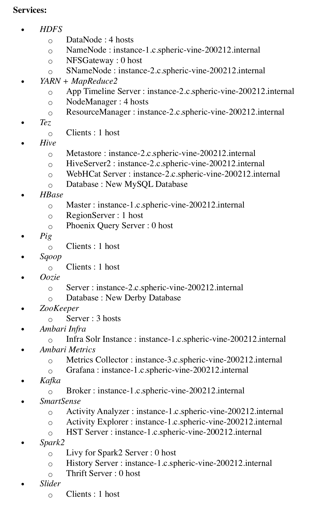

## Лаба 0. **Поднять свой кластер и отфильтровать логи из HDFS в HBase**. Решение

После выполнения инструкции по развертыванию Ambari у вас должен получится следующий набор сервисов:



Для того, чтобы заставить Hive работать, существует два варианта решения:

1. Изменить значение  'bind-address' в конфигурационном файле mysql /etc/mysql/mysql.conf.d/mysqld.cnf на '0.0.0.0' cd /etc/mysql/mysql.conf.d gedit mysqld.cnf

2. Изменить mysql server hostname на IP адрес в 'Metastore connection URL'. 

   Например, c  `jdbc:mysql://adrien.cluster/hive?createDatabaseIfNotExist=true` на `jdbc:mysql://127.0.0.1/hive?createDatabaseIfNotExist=true`

Теперь, когда проблемы с Ambari решены, можно приступать к заливке данных на hdfs. Здесь нет четких инструкций - больше рекомендаций. Более содержательную информацию о состоянии hdfs можно получить по  `*ваш хост*:50070/dfshealth.html#tab-overview `

Есть два варианта решения проблемы:

1. Загрузить все данные в условиях ограниченного пространства (30 гб на машину) 

   1) На всех машинах должны стоять `Data Node `

   2) `Block replication` в конфигурации должен быть равен единице
   3) Загружать порционно (Например, на три части), постоянно делать балансировку

    `sudo –u hdfs hdfs balancer`
   4) В случае возникновения `safe mode` посмотреть, какая машина забилась на 50070 порту. Отключить её можно, используя команду `hdfs dfsadmin -safemode leave`
   5) Загружать данные можно с разных машин, если локальное пространство забито
   Если совсем всё плохо, то можно увеличить пространство hdfs за счет `Reserved space`. Он находится в конфигурациях Ambari. Однако это самый отчаянный шаг, на который можно пойти. 

2. Увеличить объем дискового пространства -  https://cloud.google.com/compute/docs/disks/add-persistent-disk 

   30ГБ дополнительного пространства сверху хватит (которые в дальнейшем, если не понадобится, можно будет отключить)

   ​

После заливки данных необходимо установить happybase на все Map-Reduce ноды:

`sudo apt-get install python3-pip`

``pip3 install happybase`

Поднимем Thrift сервер, чтобы чекер мог подключиться к Hbase:

`hbase thrift start -p 9090 -infoport 9091`

Создаем таблицу в Hbase, где название  - ваш логин из личного кабинета:

```bash
echo "create 'ваш логин', {NAME => 'data', VERSIONS => 4096}" | hbase shell
```

У нас всё готово для запуска map-reduce. Для начала напишем маппер: 

```python
#!/usr/bin/env python3

import sys

# Enter you mod number from the assignment
my_mod = 178

for line in sys.stdin:
    row = line.strip().split('\t')
    if len(row) == 3 and row[0] != '-' and row[2].startswith('http'):
        try:
            uid = int(row[0])
            timestamp = int(float(row[1]) * 1000)
            url = row[2]
            if uid % 256 == my_mod: print("{}\t{}\t{}".format(uid, url, timestamp))
        except Exception:
        	pass
```

Следующий редьюсер:

```python
#!/usr/bin/env python3

import os
import sys
import happybase

# Hostname with Happybase
hbase_endpoint = 'ваш хост'
hbase_user = 'название вашей таблицы'

connection = happybase.Connection(hbase_endpoint)

# Table name of your choice
table = connection.table(hbase_user)

for line in sys.stdin:
	row = line.strip().split('\t')
	uid, url, t = row
	table.put(uid, { 'data:url': url }, timestamp=int(t))
```

Запустим всё, используя слудующие команды : 

```bash
#!/usr/bin/env sh


DIR_IN=/labs/facetz_2015_02_13/
DIR_OUT=/user/$USER/facetz

hadoop fs -rm -r -f $DIR_OUT

hadoop jar ~/hadoop-streaming.jar \
	-D mapred.reduce.tasks=1 \
	-input ${DIR_IN} \
	-output ${DIR_OUT} \
	-file "mapper.py" -file "reducer.py" \
	-mapper "mapper.py" -reducer "reducer.py"
```

