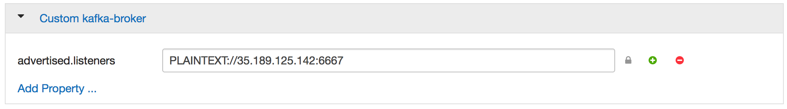
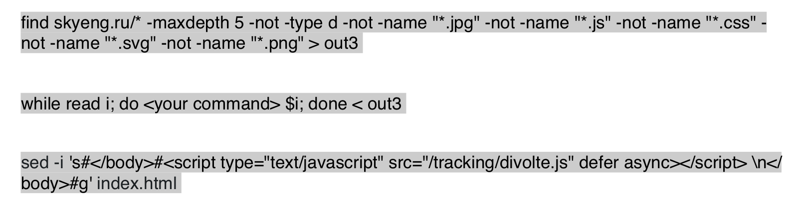

**Лаба 1. Поднять свой сайт и организовать сбор кликстрима в Kafka. Решение** 

После того, как вы собрали кликстрим на HDFS. Вам необходимо собрать аналогичный в Kafke. 

Прежде чем начем конфигурировать divolte, создадим подготовим Kafka к работе. По условию лабы необходимо кафка должен быть установлен на той ноде, ip адрес которого вы предоставили координатору. Если же у вас возникла ситуация, что он находится не там, где нужно, то достаточно воспользоваться `add/delete service`  в консоле Ambari .

Теперь добавим правило в конфигурации, чтобы консьюмер чекера мог подключиться к брокеру кафки.  Также это будет удобно, если divolte вы развернули на другой ноде. 



Создадим топик, по которому продьюсер divolte будет посылать логи. Напомню, что топик должен иметь аналогичное наименование, как и логин в личном кабинете. 

`/usr/hdp/2.6.3.0-235/kafka/bin/kafka-topics.sh --create --zookeeper localhost:2181 --replication-factor 1 --partitions 1 --topic divolte3`

Далее идет конфигурирование самого Divolte. Заходим в `divolte-collector.conf` и добавляем следующие строки. 

```bash
divolte {
  global {
    server {
      host = 0.0.0.0
    }
    hdfs {
      client {
        fs.defaultFS = "hdfs://node1.c.data-engineer-173012.internal:8020"
      }
      // Enable HDFS sinks.
      enabled = true

      // Use multiple threads to write to HDFS.
      threads = 2
    }
    kafka {
      enabled = true
      producer = {
        bootstrap.servers = "0.0.0.0:6667"
      }
    }
  }
  sinks {
    // The name of the sink. (It's referred to by the mapping.)
    hdfs {
      type = hdfs

      // For HDFS sinks we can control how the files are created.
      file_strategy {
        // Create a new file every hour
        roll_every = 1 hour

        // Perform a hsync call on the HDFS files after every 1000 records are written
        // or every 5 seconds, whichever happens first.

        // Performing a hsync call periodically can prevent data loss in the case of
        // some failure scenarios.
        sync_file_after_records = 1000
        sync_file_after_duration = 5 seconds

        // Files that are being written will be created in a working directory.
        // Once a file is closed, Divolte Collector will move the file to the
        // publish directory. The working and publish directories are allowed
        // to be the same, but this is not recommended.
        working_dir = "/divolte/inflight"
        publish_dir = "/divolte/published"
      }
      // Set the replication factor for created files.
      replication = 3
    }
    kafka {
      type = kafka
      topic = divolte3
    }
  }
  sources {
    browser {
      type = browser
      prefix = /tracking
    }
  }
}
```

Обратим внимание на две вещи:

Первое `bootstrap.servers = "0.0.0.0:6667"`.  Данный вариант подходит, если divolte и kafka находятся на одной ноде, в противном случае необходимо указать ip той ноды, где лежит Кафка, при условии того, что предварительно указан `advertised.listeners` в конфигурации.  

Второе `topic = divolte3`. Здесь необходимо указать ваш топик, который вы создали ранее. 

Запускаем `divolte` следующей командой:

```bash
ubuntu@node1:~/divolte-collector-0.6.0$ ./bin/divolte-collector
```

Для того, чтобы проверить, идут ли сообщения в кафку, воспользуемся стандартным консьюмером: 

```bash
/usr/hdp/2.6.3.0-235/kafka/bin/kafka-console-consumer.sh --zookeeper localhost:2181 —topic divolte3 --from-beginning
```

Запускаем чекер и получаем результат.

**Небольшие подсказки**

Для обновления конфигурация в nginx воспользуйтесь  `nginx -s reload`

Для занесения `divolte.js`  на все странички используйте следующие команды:



