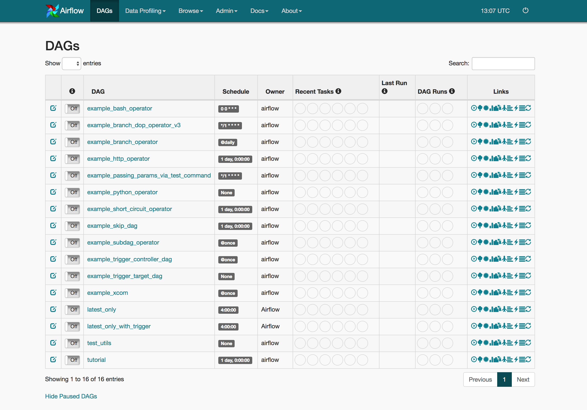
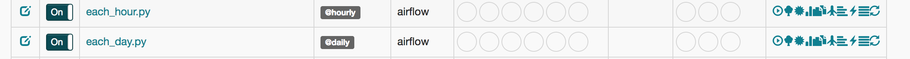

### Лаба 3. Написать планировщик, который будет токенезировать URL и сохранять в Parquet. Решение.

Вся лабораторная работа делится на четыре пункта. 

- [ ] установка airflow
- [ ] написать скрипт по токенизации логов из эластика
- [ ] написать скрипт, который сложит все собранные логи в один файл и положит на hdfs
- [ ] запустить их по расписанию в airflow 

Для начала установим Airflow, если возникли проблемы при установки, то можете воспользоваться следующим <a href="http://michal.karzynski.pl/blog/2017/03/19/developing-workflows-with-apache-airflow/">мануалом</a>. Там отлично расписано, как поставить на Ubuntu и как создать простой DAG. 

```bash
$ python3 --version
Python 3.6.0
$ virtualenv --version
15.1.0
```

```bash
$ cd /path/to/my/airflow/workspace
$ virtualenv -p `which python3` venv
$ source venv/bin/activate
(venv) $ 
```

```
(venv) $ pip install airflow==1.8.0
```

```````````````````````````bash
(venv) $ cd /path/to/my/airflow/workspace
(venv) $ mkdir airflow_home
(venv) $ export AIRFLOW_HOME=`pwd`/airflow_home
```````````````````````````

``` bash
(venv) $ airflow version
  ____________       _____________
 ____    |__( )_________  __/__  /________      __
____  /| |_  /__  ___/_  /_ __  /_  __ \_ | /| / /
___  ___ |  / _  /   _  __/ _  / / /_/ /_ |/ |/ /
 _/_/  |_/_/  /_/    /_/    /_/  \____/____/|__/
   v1.8.0rc5+apache.incubating
```

```bash
airflow_home
├── airflow.cfg
└── unittests.cfg
```

```bash
(venv) $ airflow initdb
```

```Bach
airflow_home
├── airflow.cfg
├── airflow.db        
└── unittests.cfg
```

```bash
(venv) $ airflow webserver -port 8081
```

 В результате на порту 8081 должен открыться следующий интерфейс. 



Теперь займемся скриптами. Есть два способа отправлять запросы в `elasticsearch`. Первый заключается в использовании API через curl запросы, а второй в использовании библиотеки. Примеры обоих вариантов можно посмотеть в <a href="https://marcobonzanini.com/2015/02/02/how-to-query-elasticsearch-with-python/">следующей статье</a>. В данном решении  воспользуемся предложенной библиотекой. 

```bash
pip3 install elasticsearch
```

Согласно поставленной задаче необходимо брать логи каждый час и складывать их в промежуточный файл. Следовательно необходимо разобраться, как получить логи из elasticsearch, созданные в нужном интервале. Для этого стоит обратиться к <a href="https://www.elastic.co/guide/en/elasticsearch/reference/current/search-request-body.html">официальной документации</a>, а для моделирования того или иного запроса достаточно воспользоваться `kibana`  в разделе `dev tools`. В результате получился следующий запрос:

```json
{"query": 
     "range" : {
         "@timestamp" :{
             "gte" : "now-1h",
             "lt" : "now",
             "time-zone": "UTC"
         }
     }
}
```

Теперь всё готово для того, чтобы написать скрипт, который будет таскать данные и класть их в промежуточный файл. Не забываем распарсить `location`  - для этого можно воспользоваться `urlparse`

```python
from datetime import datetime
import elasticsearch
import csv
import unicodedata
from urllib.parse import urlparse
es = elasticsearch.Elasticsearch(["35.189.125.142:9200"])
res = es.search(index="test.de.user", body=
	{"query": 
     "range" : {
         "@timestamp" :{
             "gte" : "now-1h",
             "lt" : "now",
             "time-zone": "UTC"
         }
     }
}, size=500)  
sample = res['hits']['hits']
with open(datetime.strftime(datetime.now(), "%Y_%m_%d_%H.csv"), 'wb') as csvfile:  
	filewriter = csv.writer(csvfile, delimiter='\t', 
                            quotechar=',', quoting=csv.QUOTE_MINIMAL)
	filewriter.writerow(["timestamp", "session_id", "location"])    
	for hit in sample:   
		try:			
			col1 = hit["@timestamp"]
		except Exception, e:
			col1 = ""
		try:
			col2 = hit["_source"]["session_id"].decode('utf-8')  
			col2 = col2.replace('\n', '')
		except Exception, e:
			col2 = ""
		try:
			col3 = urlparse(hit["_source"]["location"].decode('utf-8')).path
			col3 = col3.replace('\n', '')
            
		except Exception, e:
			col3 = ""
		filewriter.writerow([col1,col2,col3])
```

Следующий этап заключается в объединении собранных в течение дня логов в один единый файл, завернуть его в паркет и положить на hdfs. Существует два способа добавить в HDFS ваш файл. Первый  - добавление через <a href="https://community.hortonworks.com/articles/92321/interacting-with-hadoop-hdfs-using-python-codes.html">subprocess</a> модуль. Второй - использование библиотек <a href="http://wesmckinney.com/blog/python-hdfs-interfaces/">libhdfs и libhdfs3</a>.  Прочитать про то, как завернуть файл в паркет, можно <a href="https://arrow.apache.org/docs/python/parquet.html">здесь</a>.

```Python
import pandas as pd 
import pyarrow as pa
import pyarrow.parquet as pq
from datetime import datetime
import subprocess
filenames = [datetime.strftime(datetime.now(), "%Y_%m_%d_{}.csv".format(hour)) for hour in range(0,23)]
try:
    combined_csv = pd.concat( [ pd.read_csv(f) for f in filenames ] )
	table = pa.Table.from_pandas(combined_csv)
	pq.write_table(table, datetime.strftime(datetime.now(), "%Y_%m_%d.parquet"))
finally:
	put = Popen(['hdfs', 'dfs', '-put', datetime.strftime(datetime.now(), "%Y_%m_%d.parquet"), '/results'], stdin=cat.stdout)
	put.communicate()
```

Осталось завернуть два скрипта в dag файлы, после чего установить расписание в Airflow. 

```python
from datetime import datetime
from airflow import DAG
from airflow.operators.dummy_operator import DummyOperator
from airflow.operators.python_operator import PythonOperator

def hourly():
    #Код, что был написан для таскание данных из эластика. 
    
dag = DAG('hourly', description='Simple tutorial DAG',
          schedule_interval='@hourly',
          start_date=datetime(2018, 5,5), catchup=False)

dummy_operator = DummyOperator(task_id='dummy_task', retries=3, dag=dag)

hourly_operator = PythonOperator(task_id='hourly_task', python_callable=hourly, dag=dag)

dummy_operator >> hourly_operator
```

Аналогичный скрипт пишем и для второго скрипта c пометкой `@daily`.  В результате получаем следующую структуру файлов. 

```bash
airflow_home
├── airflow.cfg
├── airflow.db
├── dags                
│   ├── each_hour.py  
|   └── each_day.py 
└── unittests.cfg
```

Теперь можно их смело запускать. 

```bash
$ cd /path/to/my/airflow/workspace
$ export AIRFLOW_HOME=`pwd`/airflow_home
$ source venv/bin/activate
(venv) $ airflow scheduler
```

В результате получаем в 8081 порту следующий результат. 



Осталось один раз весь цикл расписания и прогнать чекер в личном кабинете. Лаба решена.